# Programmazione Grafica
## Storia
- Java 1 utilizzava AWT  
per programmare semplici GUI, AWT delegava al SO la responsabilità di creare i componenti grafici che dipendevano dalla piattaforma (difficile creare gui portabili di alta qualità)  
- Java 1.2 introduce Swing  
i componenti grafici erano disegnati su una finestra vuota, era richiesto al SO solo un modo per opitare una finestra e disegnarci  
costruito sopra AWT

## Caratteristiche di Swing
- leggermente più lento di AWT (non rilevante nei nuovi calcolatori)
- ricchi set di elementi per interfacce utente
- poche dipendenze dalla piattaforma, con conseguente esperienza utente persistente anche in caso di piattaforme differenti
- molti temi differenti
- `javax.swing` è considerato un'estensione di Java

## Componenti principali
### Frame
è la finestra top level, `Frame` (AWT) o `JFrame` (Swing)  
l'unico componente di Swing che non è disegnato sul canvas  
*usare sempre i componenti "J" in quanto appartengono a Swing*  
```
EventQueue.invokeLater(new Runnable() {
    public void run() {
      SimpleFrame frame = new SimpleFrame();
      frame.setDefaultCloseOperation(JFrame.EXIT_ON_CLOSE);
      frame.setVisible(true);
    }
});
class SimpleFrame extends JFrame {
    private static final int DEFAULT_WIDTH = 300;
    private static final int DEFAULT_HEIGHT = 200;
    public SimpleFrame() {
      setSize(DEFAULT_WIDTH, DEFAULT_HEIGHT);
    }
}
```
- di default un frame ha taglia 0x0 pixels
- bisogna definire cose succede quando il frame di un'applicazione viene chiuso
- l'evento richiama un thread
```
EventQueue.invokeLater(new Runnable() {
    public void run() {
      // Configuration statement
    }
});
```
(**bisogna sempre** fare in questo modo)
- un frame deve essere reso visibile `setVisible(true)`

### Gerarchia dei frame
- `Component`/`Windows`  
`Component` è la classe base di ogni oggetto GUI
- proprietà del frame (metodi get/set)
- classe `Toolkit`  
usata per legare alcuni componenti a una particolare implementazione nativa di Toolkit
  - Adapter pattern  

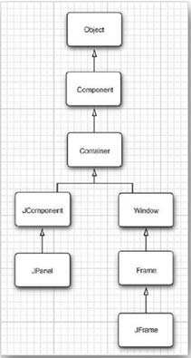

### Mostrare informazioni in un component
**non disegnare direttamente dentro un frame** (è considerato un contenitore per componenti)  
usare il content pane
```
Container contentPane = frame.getContentPane();
Component c = /* . . . */;
contentPane.add(c);
```
i componenti sono istanze di `Jcomponent`/`Jpanel`
- implementano il metodo `paintComponent` che viene chiamato dal gestore degli eventi ogni volta che una finestra a bisogno di essere ridisegnata
```
class MyComponent extends JComponent {
    public void paintComponent(Graphics g) {
      // code for drawing
    }
}
```

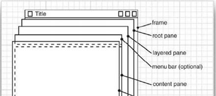  
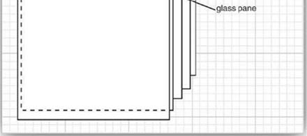

### Gestione del layout
- JDK non ha un tool per disegnare form, bisogna scrivere codice per posizionare i componenti dove si vuole  
in generale i componenti sono posizionati dentro i containers, e un **layout manager** determina la loro posizione e taglia  
  - gli elementi UI estendono la classe `Component`
    - i componenti possono essere posizionati all'interno dei containers come i panel
    - i containers possono essere inseriti in altri containers (`Container` estende `Component`)
    - composite pattern  

  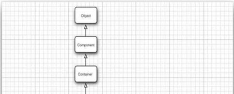  
  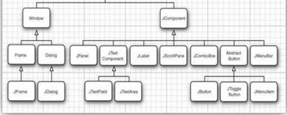
- `FlowLayout`  
  - gli elementi sono inseriti in riga, dimensionati alla oro taglia preferita, ***è il layout di dafault per un pannello***
  - se lo spazio orizzontale termina il layout usa righe multiple (*gli elementi sono centrati horizzontalmente di default*)
  - il layout cambia adattandosi alla taglia del contenitore
  - il costruttore permette di specificare l'*allineamnto* e *distanza verticale*

  esempio: aggiungere  bottoni ad un `JPanel`
  ```
  public class BorderLayoutExample extends JFrame {
    public BorderLayoutExample(String title) {
      super(title);
      // Set the size of the window
      setSize(300, 200);
      // Add component to frame
      addComponentsToPane(getContentPane());
    }
    private void addComponentsToPane(final Container pane) {
      // Panel with FlowLayout as default layout manager
      JPanel controls = new JPanel();
      controls.add(new JButton("Button 1"));
      controls.add(new JButton("Button 2"));
      controls.add(new JButton("Button 3"));
      // Content pane of the frame, BorderLayout as default
      pane.add(controls, BorderLayout.SOUTH);
    }
  }
  ```
- `BorderLayout`
  - definisce 5 regioni nelle quali gli elemnti possono essere posizionati, ***è il layout di dafault per un JFrame***
    - `BorderLayout.NORTH`, `BorderLayout.EAST`, ... (*center è la posizione di default*)  
    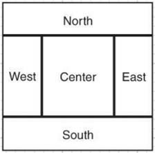
  - i bordi dei componenti sono definiti prima
    - se un container viene ridimensionato le dimensioni dei bordi sono immutate
  - fa crescere tutti i componenti per riempire lo spazio disponibile
    - per contenere un elemento si unsa un `JPanel` intermedio

  esempio: finestra con 3 bottoni in basso
  ```
  public class BorderLayoutExample extends JFrame {
    public BorderLayoutExample(String title) {
      super(title);
      // Set the size of the window
      setSize(300, 200);
      // Add component to frame
      addComponentsToPane(getContentPane());
    }
    private void addComponentsToPane(final Container pane) {
      // Panel with FlowLayout as default layout manager
      JPanel controls = new JPanel();
      controls.add(new JButton("Button 1"));
      controls.add(new JButton("Button 2"));
      controls.add(new JButton("Button 3"));
      // Content pane of the frame, BorderLayout as default
      pane.add(controls, BorderLayout.SOUTH);
    }
  }
  ```
- `GridLayout`
  - sistema tutti i componenti in riche e colonne come un foglio elettronico
    - tutti i componenti hanno la stessa taglia
    - è spesso usata per modellare una piccola parte dell'interfaccia, invece che tutta la finestra
  - i componenti sono aggiunti partendo dala prima voce della prima riga, poi la seconda voce, ...

  esempio: finestra con 4 bottoni in 2 righe
  ```
  public class GridLayoutExample extends JFrame {
    public BorderLayoutExample(String title) {
      super(title);
      // Set the size of the window
      setSize(300, 200);
      // Add component to frame
      addComponentsToPane(getContentPane());
    }
    private void addComponentsToPane(final Container pane) {
      // Set GridLayout to the panelb
      JPanel controls = new JPanel();
      controls.setLayout(new GridLayout(2, 2));
      controls.add(new JButton("Button 1"));
      controls.add(new JButton("Button 2"));
      controls.add(new JButton("Button 3"));
      controls.add(new JButton("Button 4"));
      pane.add(controls;
    }
  }
  ```
- `CardLayout`
  - usato per modellare due o più componenti che condividono lo stesso spazio  
  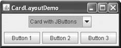
  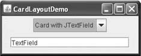
  - è come giocare con una pila di carte, dove solo la carta in cima è visibile in ogni momento
    - puoi chiedere per la prima o l'ultima carta
    - puoi chiedere di girare il mazzo avanti o indietro
    - puoi specificare una carta con un nome specifico

  esempio: finestra con 2 carte
  ```
  public class CardLayoutExample extends JFrame {
    // ...
    private void addComponentsToPane(final Container pane) {
      // ...
      cards = new JPanel(new CardLayout());
      cards.add(createCard1(), "Card 1");
      cards.add(createCard2(), "Card 2");
    }
    private JPanel createCombo() {
      // ...
      // Add combo a listener
      comboBox.addItemListener(new ItemListener() {
        @Override
        public void itemStateChanged(ItemEvent e) {
          // Get the layout
          CardLayout layuot = (CardLayout) cards.getLayout();
          layuot.show(cards, (String) e.getItem());
        }
      }
    }
  }
  ```

### Gestione degli eventi (event handling)
- un ambiente operativo monitora costantemente gli eventi e li notifica al programma  
  - il programma decide come rispondere a questi eventi (mouse click, keystroke, ...)
  - in Java (AWT) il programmatore ha pieno controllo su come gli eventi sono trasmessi dagli *event sources* agli *event listeners*
    - ogni oggetto può essere un event listener (delegation model)
    - ogni listener si autoregistra ad un event source (Observe pattern)
    - gli eventi sono oggetti di tipo `java.util.EventObject`
- riassumendo
  - un oggetto listener implementa un'interfaccia listener
  ```
  class MyListener implements ActionListener {
      public void actionPerformed(ActionEvent event) {
        // React to the event goes here
      }
  }
  ```
  - un event source può registrare un listener e spedirgli oggetti evento
  ```
  JButton button = new Jbutton("OK");
  button.addActionListener(listener); // Registering a listener
  ```
  - event source manda eventi ad ogni listener registrato
  - il listener, usando le informazioni dell'evento, reagisce di conseguenza
  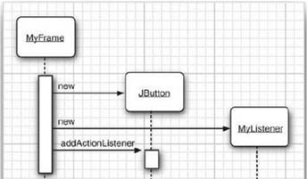  
  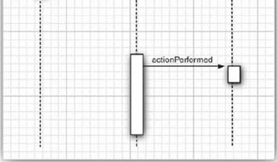

  gerarchia degli eventi  
  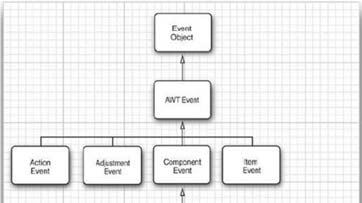  
  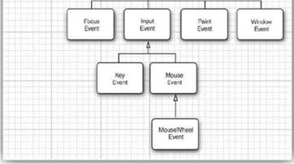

*Esempio:*
Mostreremo un pannello popolato con 3 bottoni. Quando un bottone viene cliccato, vogliamo che il colore di sfondo del pannello cambi ad un particolare colore
```
class ButtonFrame extends JFrame {
  // The panel to change the color
  private JPanel buttonPanel;

  public void makeButton(String name, final Color backgroundColor) {
    JButton button = new JButton(name);
    buttonPanel.add(button);
    button.addActionListener(new ActionListener() {
      public void actionPerformed(ActionEvent event) {
      buttonPanel.setBackground(backgroundColor);
      }
    });
  }
}
```
se il metodo della classe anonima innestata chiama un solo metodo si può usare `EventHandler`  
```
EventHandler.create(ActionListener.class, frame, "loadData", "source.text");
```  
invece di
```
loadButton.addActionListener(EventHandler.create(ActionListener.class, frame, "loadData"));
```  
**Ci sono vari tipi di eventi**  
- l'interfaccia `WindowListener` che gestisce gli oggetti `WindowEvent` ha 7 metodi:
```
public interface WindowListener {
    void windowOpened(WindowEvent e);
    void windowClosing(WindowEvent e);
    void windowClosed(WindowEvent e);
    void windowIconified(WindowEvent e);
    void windowDeiconified(WindowEvent e);
    void windowActivated(WindowEvent e);
    void windowDeactivated(WindowEvent e);
}
```
probabilmente non è necessario definirli tutti
- ogni listener AWT si interfaccia con più di un metodo attraverso un Adapter
implementare tutti i metodi con operazioni per non fare nulla
  - Class Adapter  
  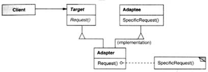
  - Object adapter  
  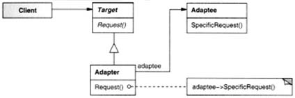
- cosa fare se bisogna condividere lo stesso comportamento n risposta a più di un evento?
  - si usa l'interfaccia `Action` che estende `ActionListener`
    - incapsula la descrizione del comando e dei parametri che sono necessari per eseguire il comando
    - Command pattern
    - `AbstractAction` è una classe adapter fornita dal JDK
    ```
    void actionPerformed(ActionEvent event)
    // Add a property to the action object indexed by key
    void putValue(String key, Object value)
    // Get a property indexed by key
    Object getValue(String key)
    ```
    - aggiungere semplicemente l'azione al componente dell'interfaccia usando il costruttore
    ```
    new JButton(new MyAction());
    ```

***Da Java8 Swing è deprecato, si usa Java FX***
