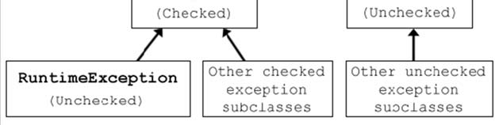

# Gestione delle eccezioni
servono a gastire situazioni particolari durante l'esecuzione del software

un metodo può segnalare la presenza di un problema  
separazione tra individuazione e gestionde dell'errore

il controllo è gestito ricorsivamente al chiamante, se si arriva fino al main e non è gestito il programma termina
- il chiamante è obbligato a controllare la presenza dell'errore
- i programmatori devono attivamente controllare e prorogare il codice dell'errore
- violazione del *Single Responsability Principle*

un metodo può segnalare un problema lanciando un'eccezione, se questo avviene il metodo non ritorna nulla e il normale flusso viene interrotto, il controllo è trasferito ad un gestore (cercato nella pila delle chiamate)
## Gerarchia Throwable  
  
  
solo la **gerarchia Throwable** può essere usata per la gestione degli errori

+ **Error** problema grave e non recuerabili quindi non vengono gestiti *(es. OutOfMemory, StackOverflow)* in quanto non si possono risolvere
+ **Exception (Checked)** uniche eccezioni controllate a compile-time dal compilatore [presenti solo in Java] *(es. IOException)*
+ **RuntimeException (Unchecked)** sono eccezioni che possono essere gestite ma non vengono dichiarate (tipicamente generate da errori di programmazione) *(es. NullPointerException)*

### Checked Exception
il metodo va dichiarato con la lista delle eccezioni che può sollevare utilizzando la keyword `throws`  
```
public void write(String s) throws IOException
```
ma questo codice è poco informativo, **usare sempre l'errore più dettagliato possibile** *es. FileNotFoundException invece della generica IOException*  1  
```
/**
 * @throws IOException if filename is null  
 */  
public void write(String s) throws IOException {...}
```
se estendo una classe e **faccio override del metodo** posso togliere delle eccezioni precedenti, ma **non posso aggiungerne**.

## Creare un'eccezione
estendo `Exception`, `RuntimeException` o un'altra classe di eccezioni esistente

devono esserci:
+ costruttore di default
+ costruttore con string
+ costruttore con `Throwable`

```
public class MyException extends Exception {
  public MyException() {}
  public MyException(String message) {
    // The error message shown in stack trace
    super(message);
  }
  public MyException(Throwable cause) {
    // Cause is the exception that generate this exception
    super(cause);
  }
}
```
## Catturare un'eccezione
la gestione di un'eccezione è compiuta da un blocco `try-catch`
```
try{  
   //codice che può sollevare un eccezione (throw)  
} catch(ExceptionClass1 ex) {  
   //gestione dell'eccezione di tipo ExceptionClass1
} catch(ExceptionClass2 ex) {
   //gestione dell'eccezione di tipo ExceptionClass2
}
```
se ExceptionClass1 è superclasse di ExceptionClass2 entrambe verranno gestite nel primo blocco e il secondo non verrebbe mai eseguito; le classi più generiche vanno alla fine

da Java7 per fare il catch di più eccezioni alla volta:
```
try{  
   //codice che può sollevare un eccezione (throw)  
} catch(ExceptionClass1 ex1 | ExceptionClass2 ex2) {  
   //gestione dell'eccezione di tipo ExceptionClass1 e 2
}
```
## Finally
se si verifica un errore e avevo aperto delle connessioni o ho qualcosa da terminare per tenere il sistema in uno stato consistente, con la clausola `finally` gestirò i casi particolari non gestiti dalle eccezioni (viene eseguito anche in caso di terminazione corretta, è il giusto modo per rilasciare le risorse)
```
try {
  // Statments
} catch (Exception ex) {
  // Handle exception
} finally {
  // Do some cleanup (release locks, close db connection, ...)
}
```
finally non contiene l'istruzione di `return`
## AutoClosable
da Java7 se una risorsa implementa l'interfaccia `AutoClosable` alla fine del blocco try-catch la risorsa verrà chiusa automaticamente evitanto il blocco finally
```
try (ResourceType1 res1 = init1; ResourceType2 res2 = init2) {
  // Statments that use res1 and res2 and
  // that could throw and exception
} catch (Exception ex) { /* ... */ }
```
## Rethrowing
è possibile in un `catch` block lanciare eccezioni
```
try {
  // Statments
} catch (Exception ex) {
  // Do something
  throw new Exception("Something is going on here", ex);
}
```
non so come gestirle ma voglio farle comparire nel log
il compilatore traccia il corretto flusso dei tipi delle eccezioni
## Stack trace
- se un'eccezione non viene catturata da nessuna parte è mostrata una Stack trace, di default è spedita a `System.err`  
- `hread.setDefaultUncaughtExceptionHandler` modifica la politica di gestione delle eccezioni
- `ex.printStackTrace()` stampa sul `System.out` lo stack trace dell'eccezione
- controllo valori null (checking nullability) [da Java7]
mette un marcatore nella stack trace semplificando le operazioni di debugging
```
public void process(String direction) {
  this.direction = Objects.requireNonNull(direction);
}
```

## Asserzioni
```
assert condition;
assert condition : expression;
```
sono attivabili e disattivabili a runtime  
vengono utilizzate in fase di sviluppo non dopo e vengono automaticamente rimosse nel codice prodotto
- lanciano un `AssertionError` se la condizione è `false`
- il valore dell'espressione è passato all'errore

## Logging
la console (`System.out`) non è sempre disponibile (processi in background) e spesso ha un buffer che non mostra i messaggi più vecchi  
in Java c'è un **logging system** classi addette a scrivere messaggi in vari canali  
*sono gerarchici e possono essere disattivati*  
La calsse padre -> **Logger**  
esemio di codice:
```
Logger.getGlobal().info("mex" + filename);
```
si può definire il proprio logger e il suo nome è gererchico
```
Logger logger = Logger.getLogger("com.company.app");
```
esistono **7 livelli** di log  
```
logger.setLevel(Level.FINE);
```
1. Severe
1. Warning
1. Info
1. Congig
1. Fine
1. Finer
1. Finest

### Gestore dei log
- i gestori dei log sono gerarchici (nome di default "" e tipo `ConsoleHandler`)
- per un log, il suo livello deve essere più alto sia del logger che del Gestore
- di default un logger manda le registrazioni sia al suo gestore che ai gestori del genitore
- esistono due altri gestori nelle API
  - `SocketHandler` manda le registrazioni ad uno specifico host e porta
  - `FileHandler` raccoglie i log in un file (`javan.log` nella cartella home) in XML

le operazioni di IO sono comunque pesanti quindi non sempre si mostrano tutti i livelli (es. differenza tra debugging e utilizzo)  
I logger sono dei **singleton** allo stesso momento esiste al più un'istanza
